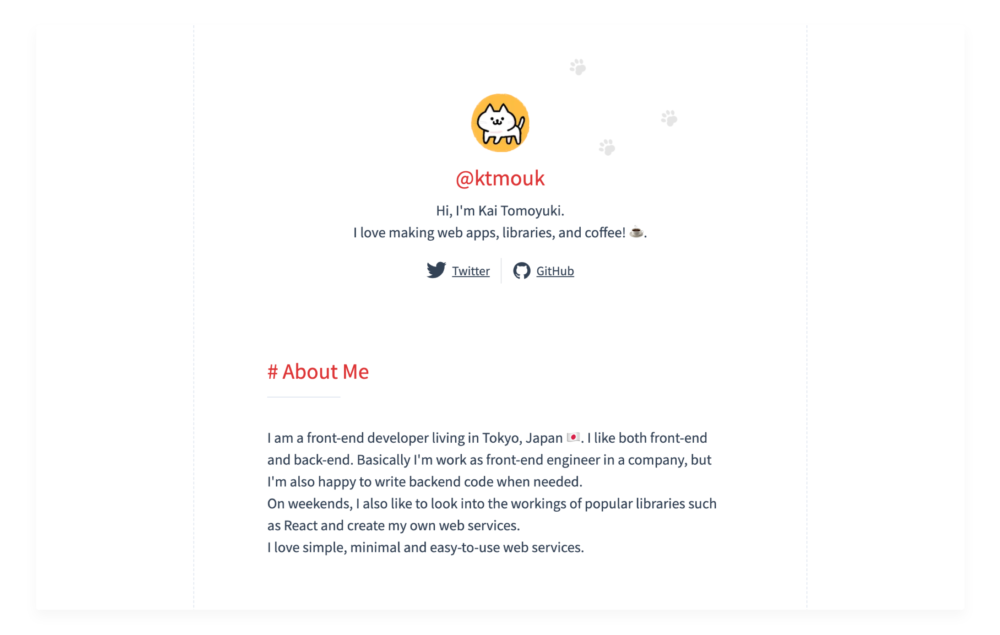

<p align="center">
  <br>
  This is my portfolio built with <a href="https://astro.build">Astro</a>. 🚀
  <br>
  <a href="https://ktmouk.github.io">ktmouk.github.io</a>
</p>

## Running Locally

To run this repository, install [pnpm](https://pnpm.io) and exec the following command.

```sh
git clone https://github.com/ktmouk/portfolio.git
cd portfolio
pnpm install && pnpm dev
```

## Forking

You are welcome to use this repository to create your portfolio.  
Please remove my profile and other personal information before using it.
